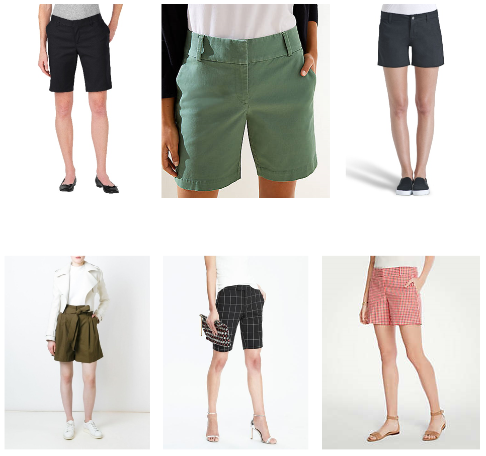

```{r setup, include = FALSE}
knitr::opts_chunk$set(echo = TRUE,
                      error = TRUE,
                      comment = "")
```

# Working Together Toward Our Mission {#mission}

Everyone is expected to follow our [mission statements](manual.html#missionStatement), including our [internal](manual.html#missionStatement-internal) and [external](manual.html#missionStatement-external) mission statement, in addition to our [diversity statement](manual.html#diversityStatement).

# Confidentiality {#confidentiality}

Everyone is expected to treat data confidentially, as described in the [Confidentiality](manual.html#confidentiality) section of the Lab Manual.

# Professionalism {#professionalism}

Everyone is expected to act professionally.
This is especially critical when participants are in the lab.
When a participant is in the lab, they should not be able to hear anyone in either the observation room or the lab offices.
In longitudinal research, each visit is exponentially more important than the last.
Treating participants like royalty is not only the right thing to do, but significantly increases the likelihood of retention.

# Communication {#communication}

Everyone is expected to communicate regularly with the team, using the appropriate methods of communication, as described in the [Lab Communication](manual.html#labCommunication) section of the Lab Manual.

# Interactions with others {#interactions}

We succeed (and fail) as a team.
All lab members are expected to respect each other.
This includes treating others with kindness and compassion, addressing others respectfully (including using appropriate titles, and people's preferred pronouns), listening when others speak, and allowing others to share their perspectives.
This lab has a zero-tolerance policy for harassment or discrimination of any kind.
Statements and behaviors that are demeaning or aggressive will not be tolerated.
Likewise, lab members are also expected to respect colleagues in the Department and the University, and our participants.

If another member of the lab is not complying with these policies, please first attempt to speak to the person directly.
The APA Code of Ethics advises that this is a first step toward resolution.
If that is not possible, appropriate, or proves ineffective (i.e., does not change behavior), please speak to Lab Coordinator or Dr. Petersen about the problem immediately.

# Dress Code {#dressCode}

While in lab and on days when you do *not* have lab-related meetings outside of the Department:

Everyone is expected to follow a "casual professional" (i.e., "business casual") dress code while in lab.
Jeans and denim capris are acceptable when in lab, as long as they are not ripped or frayed.
T-shirts without inappropriate graphics, text, cut-outs, etc. are acceptable.
Leggings are permitted if they are worn as tights (i.e., under a skirt, dress, shorts, or long shirt that fully covers the bottom).
Shorts are permitted if they are twill or chino material and reach *at least* to your mid-thigh (Bermuda-length shorts, however, are more appropriate).
The following are NOT allowed: open-toed shoes, short-shorts, low-cut shirts, visible undergarments (including bralettes and sports bras), or workout/gym clothes (e.g., sweatpants, yoga pants).
For guidance on shorts guidelines, see the [DevPsy Lab Summerwear Guide](#summerwear) (below).

You are expected to dress more nicely on days that you have meetings outside of the department (such as with community partners).
On these days, you should wear a nice pair of pants/dress/skirt and shirt; you should not wear jeans or shorts.

## DevPsy Lab Summerwear Guide {#summerwear}

Shorts are allowed if they are twill or chino material and reach at least to your mid-thigh (Bermuda-length shorts, however, are more appropriate).
This also applies to dresses and skirts—they must reach at least your mid-thigh, and are not advised for LV1 Es on visit days.
Denim jeans and capris are always allowed, as long as they are not ripped or frayed.
T-shirts are allowed, as long as they: do not have any inappropriate graphics or text, revealing cutouts or designs, or are cropped in length.
Please note, though, that your outfit cannot reveal any undergarments (including lace bralettes or sports bras).

**PRO TIPS FOR SHORTS IN A PROFESSIONAL ENVIRONMENT**

GO FOR LENGTH\
Choose a hem that is appropriate for your unspoken office dress code— mid-thigh to Bermuda length are your best bet.

THE PERFECT STYLE\
Opt for a flowy fit with a simple graphic print.
While we know cut-offs and tight spandex styles are fun, these should be saved for after-work wear.
A sophisticated fabric, such as chino shorts, will help keep your ensemble fresh and professional.

https://www.stitchfix.com/women/blog/ask-a-stylist/are-there-work-appropriate-shorts

To pull off shorts at the office without raising alarm or workplace scorn, we compiled an Atkin-approved guideline of dos (and one don't).

- Do find shorts of an appropriate length.
"I would recommend mid-thigh to the knee—anywhere in that range."
- Do not wear short shorts.
That means, no booty shorts or frayed denim cut-offs.
- Do look for shorts cut from an elevated cloth.
Try "a chino material or cotton.
I like tailored shorts that have structure, but are also lightweight."
- Do seek out special detailing.
Pleats down the front, a clean hem, or a high-waisted silhouette are great examples.

https://web.archive.org/web/20210303123710/https://www.instyle.com/news/summer-wear-shorts-office

The cardinal rule: Stay away from cutoffs, which are almost universally considered too casual for any workplace, and opt instead for a tailored pair of Bermuda-length shorts, which offer conservative hemlines and an overall more polished look.

https://www.realsimple.com/beauty-fashion/clothing/are-shorts-work-appropriate

While temperatures are warm outside, you might be tempted to dress down at the office and reveal more skin than you should.
But Clinton Kelly, co-host of TLC's "What Not to Wear" reality series, says, "Resist the temptation."

"When it comes to your career, the image you're projecting at work makes a difference in how far you're going to get in the company," he says.
"Don't use excuses like, 'It's hot outside,' to not dress appropriately."

https://www.monster.com/career-advice/article/work-attire-whats-appropriate-and-whats-not-hot-jobs



# Consequences of Non-compliance {#noncompliance}

If we become aware of violations of our values, policies, or expectations, Dr. Petersen and/or the Lab Coordinator will discuss the matter with the person directly and in close temporal proximity to being made aware of the situation.
We will first attempt to understand the situation, including both the behaviors and the antecedents.
We will also try to clarify expectations and provide constructive feedback around the specific task, behavior, interpersonal interaction, or scenario.
Discussion will center on prevention of such behaviors in the future.
The consequences will vary based on the specific behavior, and may include consequences such as: meeting individually with Dr. Petersen and/or the Lab Coordinator and possibly other departmental leadership, making repairs with the other party, development of a plan to monitor and correct the behavior so it does not recur, dismissal from the lab, and dismissal from the program.

# Role-Specific Expectations {#roles}

In addition, people are expected to follow their expectations for the role, including expectations for [undergraduate research assistants](expectations-undergradRA.html), [SROP students](expectations-SROP.html), [graduate students](expectations-gradStudent.html), [postdoctoral scholars](expectations-postdoc.html), the [Lab Coordinator](expectations-labCoordinator.html), and [lab staff](expectations-labStaff.html).

