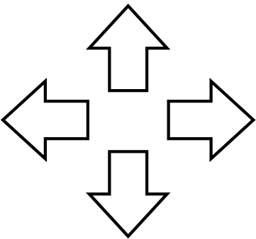
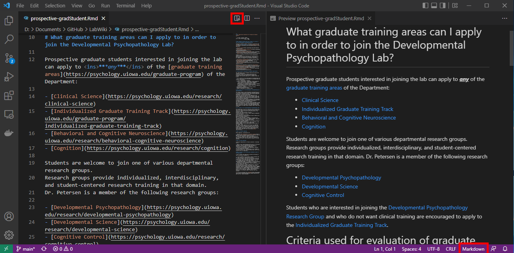
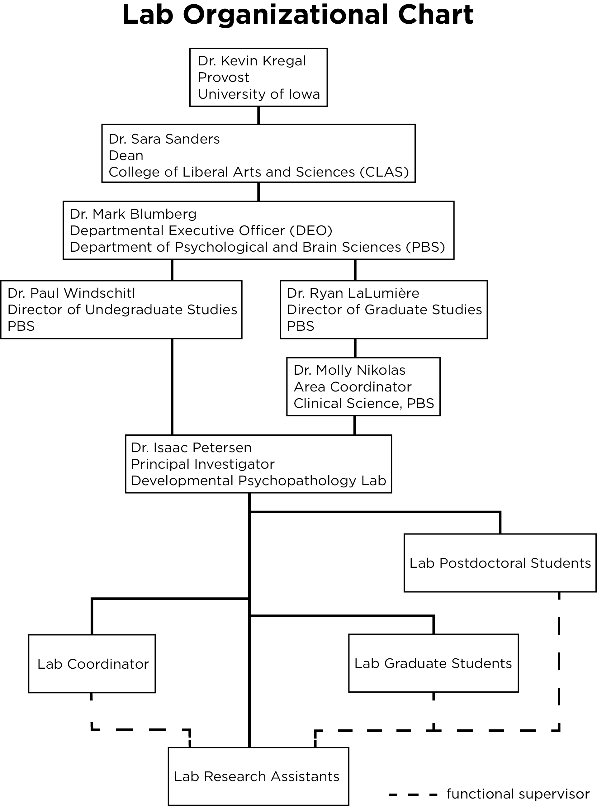

```{r setup, include = FALSE}
knitr::opts_chunk$set(echo = TRUE,
                      error = TRUE)
```

# Mission Statement {#missionStatement}

## External Mission Statement {#missionStatement-external}

We are striving to improve the health and well-being of families and communities by conducting research to advance the understanding of human development.

Date drafted: May 2018

## Internal Mission Statement {#missionStatement-internal}

As members of the Developmental Psychopathology Lab, we strive to create, maintain, and improve a fun and collaborative culture.
We commit to bettering ourselves and others through respect, hard work, ethical practices, support, and meaningful, lasting relationships.
As a team, we cultivate a supportive environment for a free exchange of ideas and embrace the value of failure to foster personal and professional growth.

Date drafted: August 2018

## Diversity Statement {#diversityStatement}

We seek to include members of various cultural, ethnic, and socioeconomic backgrounds so that our research might best represent the families which make up our diverse communities.
We aim to provide a welcoming and respectful environment for people of all backgrounds.

Date drafted: October 2020

# Lab Glossary

DevPsy Lab
: shorthand for Developmental Psychopathology Lab

RA
: research assistant

E
: experimenter

TC
: target child, or the child participant

coding
: the term means different things depending on the context.
In our lab, we use "coding" as a shorthand to refer to "behavioral coding from video," which involves assessing a construct from video observation to turn the video segment into numbers that can be analyzed.
This is distinct from computer programming, which is another type of coding.

RTFM
: Read the ******* manual

RTFC
: Read the ******* checklist

[Note: I moved the section on Dress Code  to the `expectations-everyone.Rmd` file. We will also move the summerwear section there.]: # 

# CITI Certification

Before you can interact with any data in the lab (including observing visits) you must be certified on human subject research protocols.
This means completing the CITI training, which will upload to the IRB.
You will need to complete the **Group 1 – Biomedical Research – IRB-01** course.
Instructions are below.
If you have questions, please follow this link: https://hso.research.uiowa.edu/certifications-human-subjects-protections-citi

1. Enter the CITI program at https://www.citiprogram.org
1. On the Main Menu screen, under the 'University of Iowa Courses' tab, in the 'My Learner Tools for University of Iowa' box, select the 'Add a Course or Update Learner Groups' link 
1. Select the "I am required to complete human subjects' research training." to complete the IRB required course for certification in Human Subjects Protections.
Click on the 'Next' button.
1. Select Group 1 –Biomedical Research – IRB-01.
Click on the 'Next' button.
1. On the Main Menu screen, under the 'University of Iowa Courses' tab, click on the title of the course to enter course.
1. Click on the 'Complete the Integrity Assurance Statement before beginning the course' link and complete.
Click on the 'Submit' button.
1. Click on the title of the first module to begin.
1. Complete all of the required modules.

When you have finished the course, please send the Lab Coordinator a PDF of the completion certificate.

If you have already completed the HSO/IRB certification, just bring/send a copy of your certification.
Please note, however, that it must be Group 1 – Biomedical Research – IRB-01.

**IMPORTANT**: It is likely that you will receive an email from the IRB upon completion of your IRB-01 CITI training asking you to confirm your lab, PI, the study, or that you completed the correct training.
This is because it is uncommon for psychology labs to complete the IRB-01 training instead of the IRB-02 training.
IT IS CRUCIALLY IMPORTANT THAT YOU RESPOND TO THIS EMAIL.
If you do not, it will delay our ability to add you to the IRB project, and thus delay your ability continue RA training.

The basic information they may ask you to confirm is:

*Department*: Psychological and Brain Sciences\
*PI*: Dr. Isaac Petersen\
*Which study or training*: the IRB-01 study

# Confidentiality {#confidentiality}

As part of every participant's consent process, we promise that we will protect their information.
Therefore, it is imperative that all identifying information related to our participants remains confidential.
Below are guidelines on how to handle study data and participant information.

**Handling Data**

All hard-copy physical research data must remain in the lab.
All electronic data should be accessed from the lab, on university computers, or secure private computers.
Electronic data should not be accessed on public computers.
Identifiable electronic data (including visit videos) should be stored only on the lab's RDSS share and should not be saved onto your computer.

**No Talking About Participants Outside of Lab**

It is important that you *not* talk about participants outside of lab.
Even if you are talking to other RAs or people on our IRB project, you never know who else might hear your conversation.
Therefore, you should never use participant names, addresses, physical descriptions, or any other personally identifying information outside of the lab space.

**Photos and Social Media**

No one should ever take photos, screenshots, Snapchats, or any other kind of video recording of lab data, including visit videos.
Additionally, no data or identifying information should be shared on social media, through email, etc.
Even when using Slack to communicate with team members about visits or lab-related tasks, team members should always use TCIDs and waves, which are de-identified, to refer to specific participants/videos.

**Remote Access**

RAs should never access lab data remotely without permission or direction from the Lab Coordinator, a graduate student, or the PI.
This is to ensure that the RA has received all of the requisite training, instructions, and resources to properly access data remotely.
After receiving permission or direction to work on lab tasks remotely, it is critical that all team members follow these basic guidelines:

- No lab-related data or documents should be saved to your local computer
- All lab-related data or documents should only be opened when no one else can see your computer screen or hear visit videos.
Therefore, if your parents/roommates/friends/etc. are in the room with you and can see or hear the videos, DO NOT OPEN THEM.

# How to Register Lab for Credit {#courseRegistration}

## Regular Credit

Students who wish to receive credit for time spent in the lab may register for "PSY:3994:01IND – Research Practicum in Psychology" or "URES:3992".
Generally, students enroll in "PSY:3994".

URES:3992 is 0-hour and has no tuition or fees associated.
It is recommended to enroll in URES:3992 when you cannot take credit-bearing courses (e.g., if you are getting paid, if you don't have the ability to maintain a regular schedule, etc.).
URES:3992 is also useful for students in the summer so you don't have to pay the tuition and fees (which you will have to pay if you take a credit-bearing course).

Keep in mind that some courses differ in the way that they are graded.

- Students receive a letter grade (see the section on [Honors Credit](#honorsCredit)) for PSY:4990 and HONR:3994.
- Students receive a Pass/Fail grade for PSY:3994.

There are several advantages to registering for course credit:

- Your participation in lab will be included on your transcript, which can look good when you apply to graduate/professional school and jobs
- If you meet the hours and expectations, it can also help your GPA
- The 10 hours per week you spend in lab will be accounted for in your course schedule

[XXX][**INSERT SCREENSHOTS**]

## Honors Credit {#honorsCredit}

Students who wish to receive Honors credit for participation in lab may register for "HONR:3994:01IND – Honors Research Practicum".
In addition to enrolling on MyUI, you can find the Honors Research Practicum syllabus on the lab drive (to be read and signed by the RA and Dr. Petersen) here: `\\iowa.uiowa.edu\Shared\ResearchData\rdss_itpetersen\Lab\Miscellaneous\Course Syllabi\`

If you are completing an Honors project and thesis in the lab, with approval by Dr. Petersen, you may enroll for "PSY:4990 – Honors Thesis Research".
Advantages for registering for honors course credit are:

- Your work in the lab will be included on your transcript (letter graded), which can look good when apply to graduate/professional school and jobs
- The 10 hours per week you spend in lab will be accounted for in your course schedule
- The hours accumulated in the lab can count towards your honors experiential learning (up to 12 semester hours)

Interested students may be able to conduct an Honors project.
For information on conducting an Honors thesis/project, see [here](https://devpsylab.github.io/LabWiki/honors-expectations.html).
Note that conducting an Honors project is not a requirement for enrolling in HONR:3994.

[XXX][**INSERT SCREENSHOTS**]

### How to Fulfill the Experiential Learning Requirement for Honors Credit

HONR:3994 and PSY:3994 will appear automatically on your Honors degree audit as fulfilling part of the experiential learning requirement for Honors credit.

A student can still receive Honors credit by registering for URES:3992 or by participating in the lab on a volunteer basis without it showing on their transcript (so long as the student still completes their required 10 hours).
However, these semester hours will not count toward the experiential learning requirement unless additional steps are taken.

1. Complete the Pre-Experience Questionnaire before the semester begins
    a. https://uiowa.qualtrics.com/jfe/form/SV_6SGzYkFp1wQJJit
1. Complete your lab responsibilities and engage in your 10 hours of research each week!
1. Complete the Post-Experience Questionnaire after the semester ends (within the next 5 weeks)
    a. https://uiowa.qualtrics.com/jfe/form/SV_d1le3qR9toEIyCF
1. Submit a Narrative (within 5 weeks of semester end)
    a. This final project is flexible in its formatting, but an essay (the typical choice) should be 500–1,000 words in length.
	This will allow you to reflect on your experiences and how you grew.
	A couple images, an author bio, and highlights of your experience are all required components of this piece. 
    b. https://uiowa.qualtrics.com/jfe/form/SV_cDaXMAsEr3pHY57

More information on the Honors experiential learning process for research involvement can be found here: https://honors.uiowa.edu/experientiallearning

# RA Roles

The Developmental Psychopathology Lab uses a "generalist with specialization" approach—there are some tasks that all RAs are trained to perform, and there are other tasks that RAs specialize in.
We have three specialized tracks or roles that RAs can train in after completing basic lab training: [Behavioral Testing Specialist](#behavioralTestingSpecialist), [Electroencephalography (EEG)
 Specialist](eegSpecialist), and [Data Specialist](dataSpecialist).
 **Every role is important**.
Placement in these roles depends on each RA's (a) interests, (b) aptitude, and (c) fit, in addition to (d) the team's needs.
We take into consideration the desired placement of every RA, but ultimately Dr. Petersen and the Lab Coordinator make this determination based on a, b, c, and d from above.

Below are cross-cutting responsibilities that all RAs are expected to contribute to.

**Cross-Cutting Responsibilities**

- data entry
- coding behavioral tasks from video
- keeping lab clean and family- and child-friendly
- quality control and improvement
- helping run visits
- updating/editing coding manual as needed
- auditing "Question and Answer" (Q&A) and "Quality Control Improvement" (QCI) documents
- providing answers to coding questions when applicable

## Specialized Roles

### Behavioral Testing Specialist {#behavioralTestingSpecialist}

Below are necessary characteristics and potential responsibilities for Behavioral Testing Specialists:

**Necessary Characteristics:**

- works well with 3–7-year-old children and parents
- positive and cheerful attitude
- mature
- able to quickly and easily soothe upset children
- able to stay calm and composed in the face of pressure
- able to follow a script with adherence yet flexibility to tailor it to the individual child (based on the child's age, interests, intellectual capacity, etc.)
- able to take feedback non-defensively and learn from feedback
- confidence to remain in control of a chaotic environment

**Responsibilities Could Include:**

- serving as an experimenter (E) for behavioral testing (lab visit 1; LV1) visits
- training new LV1 Es
- assuring procedural adherence for LV1 (including coaching RA and Camera roles, collaborating with other Es to ensure consistent administration)
- editing/updating LV1 manual procedures and scripts as needed
- keeping LV1 observation room stocked and prepped for visits
- having a lighter focus on coding

### EEG Specialist {#eegSpecialist}

Below are necessary characteristics and potential responsibilities for EEG Specialists:

**Necessary Characteristics:**

- technical skills
- attention to detail
- confidence to remain in control of a chaotic environment
- comfortable trouble-shooting issues with technical equipment (after receiving extensive training); ability to follow strict procedures and guidelines
- works well with 3–7-year-old children and parents
- mature

**Responsibilities Could Include:**

- serving as an E for EEG (lab visit 2; LV2) visits
- training new LV2 Es
- assuring procedural adherence for LV2 (including coaching RA roles, collaborating with other Es to trouble-shoot technical issues and assure procedural adherence)
- editing/updating LV2 manual procedures and scripts as needed

### Data Specialist {#dataSpecialist}

Below are necessary characteristics and potential responsibilities for Data Specialists:

**Necessary Characteristics:**

- professional communication skills
- knows the study well (able to describe the study and consent form thoroughly, can answer questions about the study)
- able to interact well with people in the community for purposes of making connections with schools/preschools/daycares for recruitment
- highly organized
- attention to detail
- technical skills
- creative for developing recruitment and retention tools and discovering recruitment sources
- comfortable in connecting with diverse people in diverse places

**Responsibilities Could Include:**

- heavier focus on coding, coding tasks with advanced programs (e.g., Datavyu)
- REDCap additions and edits (upon completion of advanced REDCap training)
- train new RAs in LV1 RA and Camera roles, and LV2 RA roles
- help run visits in RA and Camera roles
- recruitment and retention, including helping to develop/improve current recruitment and retention systems and devising new recruitment and retention possibilities, updating social media pages
- helping to develop new coding systems

# RA Advancement in Lab

The DevPsy lab is happy to offer exceptional RAs the opportunity to gain advanced research experience in the form of leadership roles within the lab.
Eligibility is at the discretion of the Lab Coordinator and Dr. Petersen.

## Eligibility Criteria

Below are the eligibility criteria for advancement in lab:

- Has been an active and engaged RA for at least 4 full semesters
- Has shown a personal interest in the research being conducted in lab/research in general
- Meaningful and engaging research and leadership opportunities can be helpful in building a CV and research background, but it also can involve considerable work and responsibility.
Therefore, prospective Advanced RAs should be **self-motivated** and have consistently shown that they are **reliable** and **capable of additional responsibility**.

## I meet the criteria, what should I do next?

After you have met all the criteria and feel that you are ready to pursue this opportunity, <ins>it is your responsibility to set up a meeting with the Lab Coordinator and Dr. Petersen</ins>, and to determine what types of responsibilities and projects you would like to lead.
You should be prepared to come to this meeting with a thought-out idea of what projects and roles you are interested in given these new responsibilities and privileges.

## Potential Advanced Roles

Some advanced roles that can be pursued include (but are not limited to):

**If you are already a Behavior Testing Specialist and want to pursue further advancement to become an *Advanced* Behavior Testing Specialist:**

- Lead E: training, supervising, quality control (procedural and data audits) for LV1

**If you are already an EEG Specialist and want to pursue further advancement to become an *Advanced* EEG Specialist:**

- Lead E: training, supervising, quality control (procedural and data audits) for LV2
- Preliminary help with data analyses and data processing (e.g., EEG data)

**If you are already a Data Specialist and want to pursue further advancement to become an *Advanced* Data Specialist:**

- Advanced coding responsibilities, including Datavyu coding, helping develop new coding systems for tasks not currently being coded, etc.
- If you wish to be trained on Datavyu coding, you must commit to staying in lab at least an additional 3 semesters from when training begins.
- In charge of recruitment and retention events/opportunities
- Coming up with new ideas and systems for implementation
- Contacting organizations to coordinate recruitment
- Social media, postcards, newsletter, holiday cards, diplomas

## Benefits of Assuming an Advanced Role

**Research works for your CV:** One of the major perks of this role is that you may be able to pursue a written piece of research (paper, poster, conference presentation, etc.) that can be a great boost for your CV!

**Collaborative research projects in the lab:** This can take many forms (e.g., poster, paper).
You are encouraged to ask a current advanced RA, a graduate student in the lab, the Lab Coordinator, and/or Dr. P about what this may entail.

**Reduced availability expectation:** advanced RAs are expected to make themselves available 1 night per week & 5 weekend days per semester to train/coach new experimenters/run visits (when needed).

**Registering for Advanced Research Practicum in Psychology (PSY:3995):** if the RA's role includes advanced participation in lab-related research projects in such a way that includes significant reading and writing, the RA may register for Advanced Research Practicum in Psychology PSY:3995.

## A Note About Other Opportunities for Advancement

In addition to opportunities for advancement in lab, there may also be opportunities to conduct independent research projects, to conduct an Honors project/thesis, or to contribute to papers, grants, or conference poster presentations.
An important part of professional development is learning to advocate for yourself and to inquire about opportunities that are available.
If you are interested in gaining experience in a certain area of lab work, taking on a leadership role, or if you are interested in an opportunity to take on a more advanced role in the project, then ask!
There may be opportunities available for RAs to gain experience in specialized areas of lab work (e.g., recruitment of participants, data processing) or even to earn authorship on a paper or poster for an ongoing project.
If you are motivated to gain these kinds of opportunities, you are welcome to ask and see what may be available.
Advanced projects are given priority to RAs who have shown reliability and commitment.

## Honors Theses/Projects

For information on conducting an Honors Thesis/Project, see [here](https://devpsylab.github.io/LabWiki/honors-expectations.html).

# Lab Buddy System

Our buddy system is a knowledge-sharing method that we use when onboarding new RAs into the lab.
Each new RA is paired up with an existing RA who will guide them through their first weeks in their new role.
The exchange of information goes both ways.
New RAs are encouraged to share tips, knowledge, and techniques from previous experiences, while the existing RAs makes sure that new lab members feel welcome. 

During their first weeks, new RAs can feel very overwhelmed and lost, because they are presented with considerable new information in a short amount of time.
Although new RAs typically have the essential skills and interests to succeed in the lab, they are unfamiliar with the work culture, the lab processes, and "unspoken rules[^1]."
While the coding team teaches the RA the coding and entry skills, a lab buddy helps a new RA to ease their transition during the orientation phase and provides guidance and advice in a more informal setting.
The goal of the buddy system is that new RAs feel welcome and have someone in the lab they can connect with.
New RAs should be introduced to their buddy at the end of their orientation session.

# Scheduling {#scheduling}

## Scheduling Expectations {#schedulingExpectations}

[Note: Move this section to the `expectations-undergrad.Rmd` file]: # 

### Your responsibilities as an RA

You are expected to be in lab for 10 regularly scheduled hours per week, on average, during the semester (excluding university holidays, breaks, and finals week).
If you exceed 10 hours during any given week (e.g., helping run lab visits outside of your normal hours), you should work with the Lab Coordinator to determine when you may cut back your lab hours in later weeks.

Unless otherwise stated, running lab visits is always the top priority.
If you are asked to help run a lab visit in a given week, then running the lab visit is the prioritized use of your allotted weekly hours.
If you are able to run a lab visit, and are asked to do so, we expect that you run the lab visit, even if it means not completing other lab responsibilities for the week; for example, it is okay for coding and entry duties to "pile up" if you are running lab visits.

You are responsible for keeping the "RES-DPL-Busy" calendar up to date, including evenings and weekends, and to keep the Lab Coordinator informed of any changes as they occur.

You are expected to track your lab hours honestly using the electronic scheduling system.
You should diligently clock in and clock out every time you are in lab, and should only be "on the clock" while you are doing scheduled lab-related work or activities.

If you come into lab to help run lab visits during university breaks, the hours can count as hours for either the current semester (if you are "under hours" for the semester), or toward the following semester (if you are "over hours" for the semester).
Completed lab-related hours count as lab hours no matter when they occur as long as they occur when they are scheduled.
Lab hours must be scheduled/arranged with the Lab Coordinator in advance.

You are NOT expected to be in lab for regularly scheduled lab hours on university holidays.
If holidays occur during the week when lab hours are scheduled (e.g., Labor Day), the Lab Coordinator will manually enter hours for that day.

You are expected to schedule non-lab activities (course-related, therapy/medical appointments, extra-curricular, etc.) outside of your scheduled lab hours.
However, we understand that this is occasionally not possible.
If scheduling an outside activity during your regular lab hours is necessary, you are expected to first discuss this with the Lab Coordinator, to mark yourself as unavailable on the calendar (RES-DPL-Busy), and to work with the Lab Coordinator to determine when to make up the missed hours.

You are expected to be available at least two weekday evenings (M–F) per week and at least 8 weekend days per semester to run lab visits that may extend or be scheduled outside of the lab's normal business hours, which are 9:00am to 5:00pm Monday through Friday.
You will be considered "on call" the evenings and weekend days you mark as available (i.e., your scheduled "on-call days").
It is unlikely you will run a lab visit on all of your on-call days, but we may schedule a lab visit on any of your on-call days, in which case you would be expected to help run the lab visit.
You are expected to hold your scheduled on-call days available until 24 hours beforehand.
If you can no longer help run a visit you have been scheduled for, it is your responsibility to find another RA to trade with you.
Both parties are then required to inform the Lab Coordinator of the trade before it is finalized.
We will do our best to schedule families during your regular lab hours, however this may not always be possible.
We want to ensure, as much as possible, adequate coverage to accommodate families' schedules and equal distribution of lab visits after hours.
These are the minimum expectations for evening and weekend availability.
You are welcome to make yourself available more than two evenings per week and three weekend days per month to help us better meet families' needs.

### Our responsibilities to you

We appreciate that your classes—including exams and course prep—come first.
We will work with you so that your lab schedule does not interfere with your other classes.

It is greatly appreciated when RAs are able to run lab visits during breaks because breaks are often when families are available and thus it is very helpful to the lab.
RAs who are available and willing to run lab visits during breaks will accrue those hours either for the current or following semester.
Running lab visits during breaks is not an expectation of RAs.

We will schedule lab visits using the availability schedule you submitted to the Lab Coordinator at the beginning of the semester and the RES-DPL-Busy calendar.
We will never expect you to help run lab visits when you have marked yourself as unavailable on the calendar.

We will do our best to schedule a similar number of lab visits across RAs.
This will ensure RAs receive a similar amount of experience with children/families and that a small set of RAs are not overburdened by lab visits and unable to tend to their other lab responsibilities.

We will do our best to schedule families during your regular lab hours.
We will only schedule families outside regular lab hours (e.g., evenings/weekends) if necessary.

We will never schedule a lab visit outside of normal lab hours with less than 24 hours' notice to the RAs scheduled to run it.

We will work with you to help you identify when you can "cut back" when you let us know that you are over the expected number of hours for that point in the semester.

## Scheduling System Overview {#schedulingOverview}

After course registration at the end of each semester, RAs are to submit their course schedules for the following semester to the Lab Coordinator.
If an RA has a strict, set work schedule, this should be included with the course schedule.
The Lab Coordinator will review everyone's individual schedules and create a lab schedule that best allows visits to be scheduled, while respecting RA course schedules and responsibilities.
Once the Lab Coordinator has finalized the lab schedule for the semester, they will email each RA their weekly lab schedule.
This weekly lab schedule consists of 10 total hours per week.
This includes 9 weekly hours of lab time, during which RAs may run visits, help with recruitment, complete data entry and coding tasks, assist the Lab Coordinator with assigned tasks, etc.
Additionally, all RAs are expected to attend a one-hour lab meeting every week when the entire team assembles to discuss lab-related issues and science.
Once the semester schedules have been sent out to all RAs, it is expected that RAs schedule other events around their scheduled lab hours to the best of their availability (i.e., there are no major schedule changes that would impact an RA's scheduled lab hours for the semester).

By the first day of the new semester, RAs are expected to submit to the Lab Coordinator their standard weekly availability.
This should include all normally occurring weekly availability during which the Lab Coordinator can schedule them to run visits that occur outside of an RA's normal lab hours.
This availability schedule should include at least two available weekday evenings (M-F) per week.
The Lab Coordinator will keep a composite schedule of RA weekly availability to use in scheduling visits when additional coverage is needed beyond RA lab schedules.
If an RA is scheduled to run a visit during their availability but outside of their normal lab hours, the RA will be notified of the visit details via an invitation to the Outlook calendar event, but the Lab Coordinator will not reach out to them before scheduling to confirm their availability.
The RA is expected to accept the invitation to the calendar event in Outlook.

If scheduling commitments come up throughout the semester during any time that an RA submitted as part of their weekly availability, they are responsible for adding it to the shared Outlook "Busy Calendar" (RES-DPL-Busy) so that the Lab Coordinator knows not to schedule them.
It is acceptable for an RA's available evenings to vary week to week, but all RAs are expected to maintain at least two available evenings every week.
RAs are responsible for any visit they may be scheduled to run during the availability they provide at the beginning of the semester.
Therefore, it is imperative that all appointments and events that occur during their normal weekly availability are shared with the Lab Coordinator via the "Busy Calendar" as soon as possible.
If an RA has been scheduled for a visit during their availability (including available time on weekdays, available evenings, and chosen weekend days), has been notified of this visit, and cannot run the visit due to an unexpected conflict, the RA is responsible for posting on the "Scheduling" channel on Slack to ask for a cover.
It is the RA's responsibility to let the Lab Coordinator know who will cover the visit.
If unable to find a cover, it is the RA's responsibility to let the Lab Coordinator know by at least 48 hours before the visit.

For information regarding weekend visits, please refer to the "Weekend On-Call Schedule" document.

For general information regarding the scheduling expectations of the Developmental Psychopathology Lab, please refer to the "Scheduling Expectations" document (subsection within the "RA Orientation" packet).

## Weekend On-Call Schedule {#schedulingWeekend}

### Introduction

To ensure that the coverage responsibility for visits scheduled outside of normal lab hours is shared equally among all lab members, RAs are expected to sign up for at least 8 weekend days each semester when they will be "on-call".
Please note, this does not mean that you will be expected to come into lab for every day you sign up.
This does mean that if a visit needs to be scheduled on a weekend day, the Lab Coordinator may schedule you to help run that visit without first contacting you to ask if you are available.

You are expected to stay available to run visits on the days you are signed up for until 24 hours prior.
The Lab Coordinator will not automatically schedule you for a weekend or evening visit without 24 hours' notice to lab members.
The Lab Coordinator may request volunteers to run visits that are scheduled "last minute" (i.e., within 24 hours), but you are not expected to be available for "last-minute" visits unless they occur during your scheduled lab hours.
If a weekend visit is scheduled and you are on-call that day, the Lab Coordinator will tag you in a Slack with the details of the visit.

If you can no longer help run a visit you have been scheduled for, it is your responsibility to find another RA to trade with you.
Ultimately everyone is expected to be on-call for at least 8 weekend days per semester (apart from Advanced Specialists; see the section on RA Advancement).

### Preparation

To ensure the process is as efficient as possible, please bring your calendar with your weekend availability for the semester.
Bring a written list of the weekend days you cannot be on-call for that semester.

### Procedure

1. The LC will set up separate meetings with behavioral testing specialists, EEG testing specialists, and data specialists/new RAs during the first week of the semester.
At these meetings, the LC will conduct the weekend scheduling.
1. Everyone draws a number.
1. Pass the sign-up sheet around your group once, starting with the person who drew the lowest number, and continuing in order from lowest to highest number, each person cross their name off of every weekend day they CANNOT be on-call (i.e., family engagement, work, doctor appointment, etc.). 
1. Once the sheet has gone around the group once and everyone has had the opportunity to remove their name from days they cannot work, pass the sheet around, from lowest number to highest number, and every RA sign up for one day per turn.
Each round, the order reverses (i.e., snake order).
That is, whoever gets the first pick in round 1 gets the last pick in round 2.
Continue this process to sign up for days until everyone has signed up for at least 8 days each.
Note that this may mean signing up for a day that you are unavailable (in order to sign up for 8 days).
    a. Data Specialists and new RAs should sign up for Camera or RA slots—the lab coordinator may schedule these interchangeably (i.e., if your name is listed for either a Camera or RA slot, you may be scheduled in a Camera or an RA role for a visit, at the discretion of the lab coordinator).
    b. Trained returning RAs (Behavioral Testing Specialists, EEG Specialists, and Data Specialists) should prioritize signing up for visits earlier in the semester first, if possible.
    As the new RAs complete training for visit roles, they will be able to help with visits later in the semester.
    c. To help ensure that RAs are available during the days they sign up, you are encouraged to sign up for days when your peers cannot be on-call.
    Then, after everyone has signed up for 8 days, RAs will have an opportunity to trade days with each other (see below).
1. Once this process is complete, the sign-up form will be left in the RA office and remain there for one week.
During this one week, RAs will have the opportunity to make any final adjustments necessary (i.e., trade days with other RAs).
However, at the end of the one week, everyone should still be signed up for a total of 8 days, and everyone will be responsible for helping run any visits that may be scheduled on those days.

## Shared Calendars

How to add the shared calendars:

1. Open your personal Office 365 Outlook calendar 
1. Select "Add Calendar" towards the top of the screen
    a. Select "From directory"
    b. Type in the Directory box:
1. For the RA Schedule, type: "RES-RA-LC-Sched" (RES-RA-LC-Sched@uiowa.edu)
    a. Select "Open"
1. For the Participants' Schedule, type: "Developmental Psychopathology Lab" (dev-psylab@uiowa.edu)
    a. Select "Open"
1. For the RA Availability Schedule, type: "RES-DPL-Busy" (RES-DPL-Busy@uiowa.edu)
    a. Select "Open"

Here is a description of the different calendars and instructions how to use them:

1. RES-RA-LC-Sched
    - This calendar has your individual schedule in the lab.
    It is color-coded by RA.
	You can view but not edit this calendar.
    Changes to this need to be discussed with the Lab Coordinator and/or Dr. Petersen.
1. Developmental Psychopathology Lab
    - This is the general lab calendar.
    It has lab events (e.g., participant visits, lab meeting, recruitment events).
    You can view but not edit this calendar.
1. RES-DPL-Busy
    - This is where you are expected to mark yourself as unavailable for any scheduling commitments that come up during the weekly availability you submitted at the beginning of the semester.
    In order to schedule visits, the Lab Coordinator needs to know your availability during the week.
    You are expected to edit this calendar and keep it up to date with any scheduling conflicts as soon as possible.
    Please make sure that you "categorize" the event with your name, so the event is given the proper color.
	In the "Subject" line, you can simply note "Name Busy".

## TimeClock

`OpenTimeClock2008` is the program we use for keeping track of RA lab hours.
Each RA is expected to clock in before beginning lab-related work (including running visits, but if you come in early to each lunch, visit with other RAs, or anything else NOT lab work-related, then do not clock in until you are ready to work), and to clock out when they have stopped lab-related work (e.g., if you leave to get lunch, please clock out then clock back in again when you return to work).
The Lab Coordinator will add you to the system using your HawkID.
To set up your profile the first time you use the program, follow the steps below:

1. Click the TimeClock shortcut on your lab computer desktop (or go to www.opentimeclock.com/2008/free.html).
1. In the "Company Name" textbox, type "devpsylab" and click the blue "Sign In" button
1. Enter your `HawkID` in the "Username" field and click the "Login" button.
1. Go to "My settings" at the top of the page.
1. Check the "Change password" box, and create a new password in the subsequent boxes (i.e., "Current password" which can be left blank as you will not have a password until you set one up for yourself, "New password," and "Confirm new password").
Then click the "Save" button.

*NOTE*: If a pop-up window appears asking if the website can have permission to access your location, be sure to click yes or accept.
TimeClock login is GPS-restricted, so the program may not work if it is not allowed to verify your location.

To use this program to view your current hours for the semester:

1. Login to your account and click on "List view" at the top of the page.
1. Filter your days worked by adjusting the dates at the top left of the screen to encompass the current semester (either by typing in the relevant dates, or by using the dropdown calendars by clicking the calendar icons).
1.	Once you have selected the target timeframe, look at the top right-hand side of the screen above the table.
There, you will find text that reads "total hours," and should list your total time clocked-in in hours and minutes.
If you are unsure of how many total hours you need for a semester, ask the Lab Coordinator.

# The Basics of Lab

## Lab Meetings

Lab meetings will take place once per week at a pre-determined time.
The Lab Coordinator will choose the weekly lab meeting time based on everyone's schedules and will try to schedule the meeting for a time when all lab members are available.
Lab meeting is the most important time that the team has together every week, because it is the only time that everyone is present, and it helps everyone stay on the same page as part of working as a team.
Attending lab meeting is <ins>**mandatory**</ins>.

The lab meeting is generally divided into two sections:

1. The first 15-30 minutes of the meeting is reserved for lab announcements, as well as any updates or questions about the study.
If you have questions or suggestions, please raise them.
1. The second half of the meeting is reserved for an article presentation or a professional development workshop. 

## Article Discussion

Each lab meeting (with the exception of the meetings reserved for professional development workshops), an RA is expected to lead the discussion of a peer-reviewed, empirical research article of their choosing that is related to the interests (broadly defined) of the Developmental Psychopathology Lab.
RAs will sign up to lead discussion of an article on the Lab Meeting Article Sign-Up Sheet (shared via OneDrive or during lab meeting) during the first week of classes.
If there are fewer days available than there are RAs, priority is given to newer RAs or to RAs who have had fewer opportunities to lead the discussion of an article.
**All lab members are expected to contribute to each discussion.**
The RA who is leading the discussion of the article should structure the discussion following the format below:

1. Provide a brief explanation of why you chose the article.
1. Present a brief summary (~2–3 minutes) of the article's main points (it is not a book report!), in which you describe the study and its key findings.
1. Spend the majority of the time (~20–25 minutes) posing questions to elicit discussion. The questions shouldn't be too vague (e.g., don't ask "What did you think of the methods?"), but instead should be specific and aim to elicit an interesting and critical discussion.
You can also mention critiques you have, but keep it as question-oriented as possible to elicit discussion.
1. Save time (~10 minutes) for big-picture questions pertaining to the implications of the findings for science/practice/policy/life, etc.

## Lab Meeting Scribe

An RA will be designated (usually on a volunteer basis) each semester to be the lab meeting scribe.
The scribe is responsible for taking notes throughout the meeting.
The scribe also sends a brief summary of the important information from the meeting to the entire team via Slack after it has ended.

## Attendance and Absence Policies

All members of the team are expected to attend every lab meeting.
If an RA is not able to attend a meeting, they are responsible for letting the lab coordinator know as far in advance as possible so that the lab coordinator can work with the RA to arrange how they will make up the time.
They are also responsible for sending several detailed questions or comments on the article to the Lab Coordinator by the day before the meeting to help contribute to the discussion.
If advanced notice is not possible, contact the lab coordinator as soon as you are able to and explain the absence.
The RA is also responsible for reading the lab meeting agenda and summary notes after the meeting to learn what they missed.

## Lab Communication {#labCommunication}

Forms of lab communication are described below.
**Please use Slack for as much communication as possible!**
Keeping lab-related communication on Slack helps our team work most effectively and efficiently, and it saves time for the lab coordinator, Dr. Petersen, and your team members because it allows other RAs to answer questions and allows people to jump in to provide corrective feedback, as necessary.

1. Non-private lab-related communication (almost all communication)
    - Use Slack
        - See the [Slack Checklist](#slack)
        - Feel free to send messages and you can notify particular people if the message is for particular people (@isaac-petersen).
        - You can send pictures and attachments in Slack by using the plus sign next to the message.
        - Slack communication can be informal!
        We want it to be a fun place to communicate and chat with the team.
        Feel free to post memes, set up lab-wide social gatherings, etc.
1. Private lab-related communication 
    - Send to: devpsy-lab@uiowa.edu
        - Examples: Sending your course schedule for the upcoming semester, notifying lab coordinator of an absence due to personal reasons/illness, asking lab coordinator for a reference, responding to an email that the lab coordinator sent to you.
1. Communication directed specifically to Dr. Petersen rather than to the lab (e.g., to set up a meeting to discuss career goals, honors projects, etc.)
    - Send email to [Dr. Petersen](https://psychology.uiowa.edu/people/isaac-petersen)
1. Communication directed to the past members of the lab (e.g., to setup a social gathering)
    - Use Facebook
        - See the [Social Media Checklist](#socialMedia)
1. Communication directed to the public (e.g., to communicate results from a published study)
    - Use Twitter and Instagram
        - See the [Social Media Checklist](#socialMedia)

### Resolving Conflicts and Personnel Issues {#resolvingConflicts}

It is inappropriate and unprofessional to gossip about lab personnel (i.e., complaining about someone behind their back to other RAs).
If someone gossips to you about concerns/conflicts/complaints with lab personnel, please ask them to deal with the person directly, or to address the issue directly with the chain of command (see below).

If the conflict/personnel issue is with a peer, the first step is to attempt to address the problem with your peer directly.
If the conflict/personnel issue is with a peer, and you are unable to resolve the problem or you feel that this first step would be too difficult or uncomfortable for you, then please bring this to the attention of your direct supervisor (graduate student, postdoctoral student, or Lab Coordinator).
If the conflict/personnel issue is with your direct supervisor and you are unable to resolve the problem or you feel that this first step would be too difficult or uncomfortable for you, then please bring this to the attention of your main supervisor (Dr. Petersen).
Please express personnel concerns directly (in person or by email).
Do not put personnel grievances in lab reports.
We encourage you to express concerns to the chain of command if you feel the issues impair your or the team's functioning.

### Slack {#slack}

#### Getting Started

1. Download the "Slack" App to your mobile phone (it's free!)
1. You can also access Slack on any internet browser (slack.com) 
1. Create account with university e-mail and a password you will remember 
1. Enter the workspace URL "devpsy-lab.slack.com" (the Lab Coordinator should have added you to the workspace prior to your start in lab as part of your onboarding) 
1. Make sure to add yourself to all the following "Channels"
 
-	announcements
-	good-news
-	irb
-	lab-admin
-	lab-design
-	lab-meetings
-	lab-time
-	measures
-	procedures
-	quotes
-	random
-	recruitment
-	redcap
-	scheduling
-	to-discuss
-	website-socialmedia 

#### How/When to Use

1. Channels: All channels are a certain category or topic of conversation so that it is easier to locate previous discussions relevant to that topic
    a. To notify specific people in your message, type "@" and then enter in their username before typing your message (usernames are located on the left side of the screen) 
        1. `@everyone` notifies everyone (only admins can use)
        1. `@channel` notifies everyone in the channel 
    b. `#random`: Use this channel if you are running late to lab, or if you have a question or comment that does not fall within the other channel categories; can also put memes or random funny things here!
1. Attachments: Send pictures and attachments by clicking the plus sign next to the message
1. Direct Messages: Do not use direct messaging in Slack.
If you need to communicate privately with the lab coordinator or Dr. Petersen, please use email (see "Lab Communication" for more information)

Slack channels are meant to organize conversations within broad overarching topics, but within each channel we want diverse conversation to span the gamut of each topic.
For example, the `#coding` channel should include conversations ranging from discrepancies between two coders on a given task, to technical discussions about Datavyu, to general questions to the Lab Coordinator and Dr. Petersen about the constructs measured in a given task, to all of the procedures, systems, and programs in between.
Think of each channel as a "theme" rather than a specific "topic of conversation."
You should simply choose the channel that seems most relevant to the question or comment you want to share and have at it!
It is important to remember that, even though different team members are assigned different tasks within the lab, it does not mean that it is any less important for the whole team to stay informed about the general projects of the lab.
We are all collaborating on the same project, on the same team, and working toward the same general goals.

### Trello

1. Log on to trello.com using your username and password
1. On the RAs Board, there are categories of items that are done in our lab
    a. Each of these categories has a list of cards with a title
        i. Within these cards, you can comment on what needs to be done, ideas for the titled item, etc. 
        ii. Members, due dates, attachments can also be added; to assign a person to work on a card, add them to members 
        iii. To notify specific people in comments, use @username
    b. If you would like to add a card to the desired category, you can go to the bottom of the column and click on 'Add a card…' 
1. When working on a card, move the specific card to the 'Doing' category, so that others know you are working on that task
1. When the task is completed, and doesn't need to be followed up by another person, move the card from 'Doing' to 'Done'
1. When you are assigned a task in Trello that requires another labmate to follow-up:
    a. The 1st person is assigned task (member 1 icon shows on card)
    b. 1st (member 1) completes task (i.e., enters questionnaire)
    c. 1st assigns a reviewer (member 2 icon shows on card) 
    d.	Reviewer makes comments and removes their icon—signaling to 1st that task is ready for updates 
    e. 1st reads comments and makes updates 
    f. 1st assigns final reviewer (member 3 icon shows on card)
    g. Final reviewer makes additional comments and removes icon (signaling member 1 that changes have been reviewed and is ready for final updates) OR determines that task is complete and moves card to <ins>**DONE**</ins> column.

### Social Media {#socialMedia}

The purpose of our social media pages is to inform the outside world of our research.
One to two members of the data specialist team are responsible for creating posts.
All posts must be approved by the Lab Coordinator.

#### Facebook

**Private Facebook Group**

The purpose of this private group is to communicate with past and future RAs, as well as to organize fun activities outside of lab.

1. Log on to https://www.facebook.com using your email and password
2. Go to 'Groups'
3. Click on 'Developmental Psychopathology Lab' (https://www.facebook.com/groups/1483289471691634)
4. You will have to request permission to join the group
5. Once you have been added to the group, you can access the discussion, the members, events, and photos shared to this group

**Public-Facing Facebook Page**

The purpose of this page is to inform the outside world about the research, inform about changes (e.g., safety precautions, new team members) and provide updates (e.g., new research findings, conferences, grants, events in the lab)

1. Log on to https://www.facebook.com using your email and password
2. Like the lab page: https://www.facebook.com/DevPsyLab

#### Twitter

The purpose of this twitter account is to post updates with the outside world about things we are working on in the lab.
We invite everyone to follow us on this platform, so we can get the word out about what we do! 

1. Log on to https://twitter.com using your personal credentials
2. Follow @devpsylab

#### Instagram

The purpose of this Instagram account is to post updates with the outside world about things we are working on in the lab.
We invite everyone to follow us on this platform, so we can get the word out about what we do!

1. Log on to https://www.instagram.com using your personal credentials
2. Follow @dev_psy_lab

## Lab Documentation

We strive to maintain accurate, detailed, and step-by-step manuals or checklists for all lab procedures.
Written documentation is important for many reasons, including that it facilitates training, reduces the likelihood of human error, allows us to share our processes with others, and increases replicability.
If we are missing written documentation for something, please let us know and help us create a manual or checklist!

Just as important as creating written documentation is using it!
[Checklists to remind surgeons to wash their hands significantly reduce infection rates](https://www.newyorker.com/magazine/2007/12/10/the-checklist); we are doing much more complicated work than washing hands, so it is crucial to follow our manuals and checklists.
When you are training in a new procedure, do not rely just on what other RAs tell you.
Despite their best efforts to help you, RAs may sometimes describe procedures incorrectly to you, and it is important to follow what is in the manual.
If something is missing, incorrect, or out-of-date in the manual, please let us know so we can fix it.

## Lab OneDrive

We also have an online folder shared with the team through Office 365 OneDrive.
In order to access this folder, you have to first be granted permission by Dr. Petersen or the Lab Coordinator (which should happen as part of your onboarding when you first join the lab).
Once you have permission, you can access the folder here: 
https://iowa-my.sharepoint.com/personal/itpetersen_uiowa_edu/_layouts/15/onedrive.aspx?id=%2Fpersonal%2Fitpetersen%5Fuiowa%5Fedu%2FDocuments%2FResearch%2FLab%2FOneDrive

This folder contains two subfolders:

1. "For RA Edit": The documents in this folder allow for editing by all team members.
This folder includes:
    - Lab Meeting Agendas – Team: This is the running agenda for our weekly lab meetings.
    Every week, the "lab scribe" will add detailed meeting notes to this document
    - Lab Meeting Article Sign-Up: This document is used by every RA at the beginning of every semester to sign up for their article presentation day.
    RAs can then access it throughout the semester to check which day they are scheduled to present on, but should not alter their sign-up day without first obtaining permission from the Lab Coordinator
    - Task Timing Sheet: This Excel document is used by all RAs to record their coding progress (see `Coding Manual` for more information)
1. "For RA View": The documents in this folder allow for read-only access by all team members.
This folder includes:
    - RA Remote Participation:  This document outlines procedures for remote lab work, including how to setup access to the lab drive, how to remote into a lab computer, etc.

## Lab Drive

**&#35;1 Rule: Never delete any documents or data without explicit permission from the Lab Coordinator, graduate students, or Dr. Petersen first.**

If there is an old or outdated document, like an outdated checklist or an old coding form that has since been re-coded, do not delete it.
You may move it to an "00-Old" folder (see [Folder Designations](#folderDesignations) below), or, if you are unsure where it should be saved, consult your fellow lab members or the Lab Coordinator.

### File Naming Conventions

Because the Lab Drive contains so many files across so many different tasks, TCs, and areas of the research process, it is imperative that all files are carefully named following a descriptive, standardized naming convention.
**All file names should be ALL lowercase, except when using the following established lab abbreviations: LV1/2, or T1/2/3/4, or TC/PC/PP/SC**.

- For visit-related files in "*Coding*", "*Entry*", and "*Payment*" folders, the file name should include: `TCID`, `wave`, and task/document type (e.g., `1000_36_consent`).
- For files within "*Coded Data*", coding form files should also include which coder the form is from (e.g., `1000_36_grasssnow_coder1`).
- For files within "*Scoring*", scoring form files should also include which scorer the form is from (e.g., `1000_36_maps_scorer1`).
- For visit-related files within "*Payments*", file names should also indicate which visit or caregiver the receipt is from (e.g., `1000_36_receipt_LV1`, `1000_36_W9_SC`).
- Any IRB documents in the IRB folder (`\\iowa.uiowa.edu\Shared\ResearchData\rdss_itpetersen\Lab\Studies\School Readiness Study\IRB\`) that are stamped with an expiration date (e.g., recruitment materials, consents) should also indicate the year in which they are valid (e.g., `informedconsent_2018`).
When these materials expire, they can be moved to the "00-Old" folder within the relevant parent folder.

### Folder Designations {#folderDesignations}

*Old*: This file designation is used to store versions of documents that are outdated—this applies both to previous versions of active, updated documents as well as documents that are no longer in use.

*Admin*: This file designation is used to store miscellaneous admin-related documents (e.g., spreadsheets, checklists, etc.) that cannot logically be placed in another folder within the same parent folder.
These folders are not meant to be a "junk drawer" to deposit new files, rather they are a clearly identifiable home for important files that do not have another obvious home, so they are not loose in a parent folder.
If new documents are created that could logically be paired with a document in a `01-Admin` folder, then do create a new folder and move the related file from `01-Admin` into the new folder with its related documents.
If a new folder needs to be created, contact the Lab Coordinator.

**A Note About Creating New Folders:**

The RA should ask the Lab Coordinator, Dr.Petersen, and graduate students before creating a new folder within the Lab Drive.
RAs are able to create new TCID folders in their check data folders of their coding or entry task, as well as any new folders within their personal folder on the drive.

### RA Folders

For every RA who joins the lab, we create two folders that are only theirs to use: their member folder and their lab report folder.
Member folders and lab report folders are named using the RA's `HawkID`.

### Member Folders

Member folders can be found on the lab drive here:
`\\iowa.uiowa.edu\shared\ResearchData\rdss_itpetersen\Lab\Members`

Member folders should be used for any lab-related work (excluding lab reports).
They can be accessed by anyone in lab, including other RAs, so it is not advisable to save any personal or confidential documents within a member folder.
However, if you ever work on a lab-related project (e.g., recruitment material, helping to develop a new task or coding system, etc.) any relevant documents should be saved in your member folder.
When RAs graduate from the lab, these folders are archived so if we ever need to go back and find documents used in previous projects we have them saved.

### Lab Report Folders

Lab report folders can be found on the lab drive here:
`\\iowa.uiowa.edu\shared\ResearchData\rdss_itpetersen\Lab\Members\01-Lab Reports`

Lab report folders can only be accessed by the RA who owns it, the Lab Coordinator, and Dr. Petersen.
This is where you should save your bi-weekly lab reports throughout the semester.
Each lab report folder has a subfolder named "Past Lab Reports_HawkID" which should be used to archive old lab reports—in other words, every time you save a new lab report to your root lab report folder, you should move the previous one to the "Past Lab Reports_HawkID" folder.

### Lab Drive Directory—Frequently Used Folders

[XXX][**INSERT**]

## Lab Access / Keys

Sometimes when visits occur outside of normal lab hours (M–F, 9AM–5PM), the Lab Coordinator is unable to be present to open lab or lock up.
In these situations, it is permissible for RAs to open or close the lab on their own (provided the lab coordinator has requested/ approved this).
When this happens, the RA can retrieve the lab key from the lockbox or from the Department.
If the RA is unable to retrieve the key from the lockbox, follow the steps below:

1. WHERE to get keys to open the lab:
    a. The RA can access the key lockbox on the lab's entry door so that all RAs assigned to help with a visit during the lab coordinator's absence can access the lab
        i. If the LC or graduate students are in the lab and their door is open, they are more than happy to borrow their key to open lab doors. 
            1. The key lockbox passcode is changed every semester—the Lab Coordinator will provide RAs with the current passcode as needed
            1.	If the key lockbox was used, the spare lab key should be returned to the key lockbox after the lab is fully locked up (see below) so that RAs on other visits can access the lab as well
    b. If the RA cannot retrieve the lab key from the lockbox (for whatever reason), you can retrieve the key from Carrie Whittaker, who sits at the front desk in the PBS department main office (G60 Psychological and Brain Sciences Building)
        i.	If lab keys were taken from the department, return to Carrie when done
    c.	The Spare Lab Key: BAA35 = All doors to the suite (Rooms 109–119)
1. HOW to Lock Up:
    a. If you are leaving the lab and no one else is in the lab make sure to lock:
        i. All doors using key BAA35 
            1. RA and Coding rooms
            2.	All testing and observation rooms
            3.	Kitchen space 
            4.	Waiting room
            5.	Exterior door in the hallway
    b.	Return keys to appropriate location (lockbox, to the Lab Coordinator, or to Carrie (wherever it was taken from) and be sure to lock the lockbox.

## Phone Procedures

1. When the phone rings, and the Lab Coordinator is unavailable, it is the RA's job to answer the phone.
1. Upon answering the phone, say, "Developmental Psychopathology Lab, this is _____".
1. If the person has any questions, answer them to the best of your ability
    a. If you do not know the answer, ask one of the other RAs, the lab coordinator, or Dr. Petersen
    b. If you still don't know the answer, write down their question on the "While you were out" cards, and let them know that we will call them back as soon as possible
1. If the person is looking for the lab coordinator or Dr. Petersen, let them know that they are unavailable, but you can take a message if they would like.
    a. Write who called, and their message, on the "While you were out" cards that are next to the phone in the RA room.
    b. If they would like to call back later, and you know when they (the Lab Coordinator and Dr. P) will be back, let them know when would be a good time for them to call back

## Bi-Weekly Lab Reports {#labReport}

1. Lab reports are due by 5pm on Friday every other week throughout the semester.
1. Save the reports in the "Lab Reports" folder:
    a. `\\iowa.uiowa.edu\Shared\ResearchData\rdss_itpetersen\Lab\Members\01-Lab Reports\[YOUR HAWKID]\`
    b. Name the lab reports so that they are ordered by date (e.g., `Lab Report_2017-12-31.docx`).
    c. When saving lab reports, please only leave the newest lab report in the main folder—your old lab reports should be moved to the "Past Lab Reports_hawkID" folder within your personal lab reports folder.
1. Bi-weekly reports include:
    a. A brief description of what you've worked on the last two weeks
    b. What you've found interesting and why
    c. Questions you have
    d. Suggestions you have
1. In general, you don't need much discussion of what specifically you've worked on (2–3 sentences is fine).
Dr. Petersen is most interested in what you've found interesting (and why), and any questions or suggestions you have.
1. Reports should be about 1-page, double-spaced.
1. Dr. Petersen will read and comment on your reports.
Please review his comments and feel free to address anything he raised with him or with the Lab Coordinator.
1. If you have concerns about individual(s) in lab, please let the Lab Coordinator or Dr. Petersen know directly (in person or by email).
Do not put personnel grievances in lab reports.

## Tips and Tricks for Interacting with Children in Lab

### When Interacting With Families in the Lab

We strive to ensure families are as comfortable as possible in the lab.
We want to be non-judgmental.
Families should not feel like they are being tested.
If a family feels they are being tested, they may also feel they have failed if a task does not go as expected.
For example, if we instruct a parent not to let their kids touch the toys and the kid does, we leave open the possibility a family could be embarrassed.

If a family asks you a question such as:

"Do you ask us to stop our kids from touching the toys to see if they will do it?"

Our response could be: 

"We want to simulate as close to a home and school environment as we can.
We just ask you act normally."

### How to Give Praise

**Syntax**: Praise + Effort + Specific

**Acknowledging:**

-	"I know this game is hard."
-	"I know this game is tricky."

**Praise:**

-	"Thank you for"
-	"I appreciate"
-	"I really like"
-	"I notice"
-	"I can see"
-	"I can tell"
-	"I'm so impressed"
-	"I'm proud of you for"
-	"I'm so happy with you for"
-	"I like it when"
-	"Way to"
-	"Nice job"
-	"You're doing a nice job"
-	"That's a great way to"
-	"You should be proud of yourself for"
-	"It's nice that you are"

**Effort:**

-	"doing your best"
-	"trying so hard"
-	"working so hard"
-	"your effort"
-	"getting through those"
-	"concentrating so hard"
-	"kept playing"

**Specific:**

-	"sitting so still like a statue"
-	"sitting so quietly"
-	"catching the fish"
-	"not catching the sharks"
-	"sorting the flowers"
-	"not touching the mushrooms"
-	"sorting the apples"
-	"not touching the worms"
-	"sorting the sheep"

### How to Guide Children Through Difficult Tasks

#### DOs

The following are "Do"s when working with children in the lab:

- Build rapport early
    - Use comments and compliments more than questions; questions can be perceived as commands
    - Comment on things they like (e.g., their shoes, hair, shirt, favorite superhero)
    - For anxious children: they will know you are safe by judging their parents' cues, so for an anxious/clingy child, first build rapport with parent and then it will be easier to build rapport with child after they know you're safe
- Make sure the chair isn't too big for the child (i.e., their feet solidly reach the floor)
- Make it into a game!
- Use high positivity and energy: be like a "preschool teacher on crack" (in EEG especially)
    - Both verbal AND nonverbal
- Focus on the child rather than the script in the EEG visit
    - What you say matters less than how you say it (as long as you correctly explain the rules)
- If the child isn't doing what you want, focus on what you expect them to do instead of what you don't want them to do
    - "Here, hold this toy" or "Keep your hands on the table" instead of "Don't touch the…"
- Use specific praise ("Nice job sitting so still!") rather than general praise ("Nice job!")
- Praise effort, not outcome
    - "Thank you for trying so hard on these" instead of "Nice job answering these"
- Use distraction and redirection (e.g., talking to the child about the movie when putting on the EEG net)
- Model appropriate behavior (sit and watch the screen during the task)
- Give them choices we're okay with
    - "Would you rather wear the red cape or the blue cape?"
- Use Grandma's Law:
    - "When you finish catching the fish, you can have some candy."
    - "First sit down in your chair, and then we'll play the game."

#### DON'Ts

The following are "Don't"s when working with children in the lab:

- Ask commands in the form of a question ("Can you sit up in your chair?")
    - Instead: Be polite but firm.
    ("Sit up in your chair" or "Please sit up in your chair" or "Let's sit up in your chair.")
- Frame things in the negative (or the absence of negative)—i.e., don't provide reassurance ("It's going to be okay" or "It's not going to hurt.")
    - Instead: frame things in the positive ("Let's put on the special ocean cap to be just like Jamie so we can play the fun games!")
- Ask yes/no questions to "no birds"
    - Instead: Give them choices we're okay with (see above)
- Focus on the child's distress and/or apologize
    - Instead: Distract, redirect, and be positive—children respond to your verbal and nonverbal cues!

## Participant Payment

### Rules

1. Cash is preferred method of payment (lab participants/PC only)
1. Checks will be arranged as compensation for PP and SC when they complete the online questionnaire
1. Participants will be compensated according to the escalating payment schedule
1. Participants/PCs may be compensated for parking
1. Payment to PP and SC only processed after the questionnaire is verified as completed
1. All payment documents must include TCID, Wave, and date of service.
1. No documents should ever contain participant SSN's (unnecessary for our level of compensation)

### Payment in Cash Issued to PC/Participant in the Laboratory

- Each day, the Lab Coordinator will place individual payments in sealed envelopes with the TCID and Wave labeled on the envelope.
This envelope will only include compensation for the lab session in which they participate, not compensation for parking.
- A separate envelope with exactly $10 in $1 bills will be kept in the file drawer where the locked cashbox resides.
This money will be designated for parking compensation.
If this cash is added to the participant's compensation on a given day, the TCID, date, and amount needs to be written on the extra cash envelope, and this amount should be reflected on payment receipts.
- After payment has been made, relevant data will be entered in the Excel spreadsheet ledger (in the payments folder in on the lab drive).
[XXX][**Insert note about Lab Coordinator's responsibility**]
- Each participant and the RA will sign a payment receipt form confirming that they received payment.
Receipt must include TCID/Wave, data of service, amount distributed, and signatures of both participant and RA handling payment.

# Visit Videos

## Video Recording

1. Setting Up Cameras:
    a. **ON FIRST:** Camera server (black box laying on side right side under desk)
        i. '**ON**' is ***RED*** switch (bottom left corner)
        ii. **Always remember to switch 'OFF' when done using, but only turn off AFTER computer is fully turned off**
        iii. When the camera server is on, it will make noise and display 3 small colored lights (Red=protected; Green=grounded; Yellow=power)
    b. Far left knob is external microphone (other knobs are not used)
        i. Make sure knob is turned all the way to the right
1. Setting Up Computer: 
    a. **ON SECOND:** Computer, by pressing the 'ON' button at the top, left corner of computer box
    b. **USB key must be plugged in (PURPLE)—leave in at all times**
    c. Click Media Recorder 4 shortcut on desktop 
    d. Checks:
        i. Check for good volume 
            1. As quiet as it can be (so parent and child can't hear) while still being able to hear with good quality (**volume 28 or lower on computer**)
            1. Click on Volume icon (bottom RH corner of **monitor** screen)
            1. Must be on 'speaker/headphones' NOT 'DELL'
        ii. Check for camera angles
            1. 2 cameras: side-by-side display
            1. To select camera: Click the
            {width=5%}
            icon (upper RH corner of each **camera** screen)
                a. Click LH mouse button and drag in direction you want the camera to move
                b. Roll mouse scroll wheel forward to zoom in, and backward to zoom out
1. Naming Video File:
    a. Set video save location before recording with 'File Location' (lower right-hand corner of window): 
        i. `C:\LV1 Videos`
    b. Name video file using this naming convention: `TCID_Wave_LV#` (e.g., `1001_36_lv1`)
1. Recording Video:
    a. Click on **RED** recording button (bottom middle of screen)
        i. Bottom left-hand side of window will display "Recording [time]" when recording
1. After Video Recording:
    a. Click **RED** recording button after Gift Delay or at end of task 
    b. Recording automatically saves when stopped (**\*\*NAME PRIOR TO RECORDING\*\***)
        i. Press folder icon to check for proper save
    c. **Copy** LV1 video from `C:` drive to LV1 videos folder on lab drive  `\\iowa.uiowa.edu\Shared\ResearchData\rdss_itpetersen\Lab\Studies\School_Readiness_Study\Videos\Lab Visit 1\Cohort #\T#`

## No Media Release (NMR)—Video Flagging

When parents refuse media release permission, we are not allowed to use those videos for any reasons other than for coding purposes.
Because of that, we have established a procedure to identify those videos so that we do not open, view, or use them for any purposes aside from internal purposes (e.g., training, coding, etc.).

**Procedure**

**[XXX]NOTE: THIS SECTION SEEMS STUDY-SPECIFIC. CAN WE MOVE IT OUT OF THE GENERAL LAB MANUAL?**

1. LV1 Videos 
    a. Save video as: `TCID_ WAVE_LV1_NMR` (all uppercase letters) to the following location: `\\iowa.uiowa.edu\Shared\ResearchData\rdss_itpetersen\Lab\Studies\School Readiness Study\Videos\Lab Visit 1\`
1. LV2 Videos
    a. Save the set of videos following normal procedures to the following location: 
`\\iowa.uiowa.edu\Shared\ResearchData\rdss_itpetersen\Lab\Studies\School Readiness Study\Videos\Lab Visit 2\`
    b. Label the folder of the set of videos as: `TCID_NMR`

## Backing up Data to DVDs

Visit data is backed up in several different places to ensure its safety—there's nothing worse than losing data!
Beyond saving hardcopy forms and saving videos and data to the Lab Drive, we also burn data to DVDs to store as hardcopy backups of our electronic data.
For LV1, we save the LV1 visit videos.
For LV2, we save all data and video files except for the visit video from the camcorder.
Find which video to burn through the task timing sheet, but do not blindly trust it, sometimes 'yes' is not written along a TCID but a DVD is already there.
Check the burned DVD case folder to be sure.

**[XXX]NOTE: THIS SECTION SEEMS STUDY-SPECIFIC. CAN WE MOVE IT OUT OF THE GENERAL LAB MANUAL?**

### LV1 Videos

Full-length visit video, found in TC folders in `\\iowa.uiowa.edu\Shared\ResearchData\rdss_itpetersen\Lab\Studies\School Readiness Study\Videos\Lab Visit 1\`

1. Open the DVD compartment of the CPU of your computer by clicking the button on it.
Insert the DVD.
1. A window that says, 'How do you want to use this disc?' should pop up.
Select the 'With a CD/DVD player' option.
1. Rename the DVD to 'TCID_wave_LV1' and click next.
1. Find the video in `\\iowa.uiowa.edu\Shared\ResearchData\rdss_itpetersen\Lab\Studies\School Readiness Study\Videos\Lab Visit 1\` according to the cohort and time.
1. Confirm that you are copying the correct file from the Task Timing Sheet on the Lab's One Drive online.
Copy the video and paste it in the empty DVD drive.
1. After the copying timer titled 'Copying 1 item from Tx to Burn' reaches 100%, go to the DVD drive and click right anywhere on the empty space.
Select the 'burn to disc' option from the menu that appears.
1. In the 'Burn to disc' window that pops up, make sure you have entered the disc name correctly and the recording speed is 8x before clicking next.
1. If the CPU is making scary noises like it's going to burst and propel you into an existential crisis, the burning is working. :)
1. A video will pop up that will ask if you want to create another disc with these files, do not check the box that says yes, just click finish.
1. The DVD compartment will already be open, take out the DVD and write `TCID_wave_LV1 – Tx` on it with a sharpie and put it back in the DVD case.

### LV2 Files

See LV2 Procedures Manual for information regarding [XXX][**INSERT**]

Data backup is a responsibility that is assigned to select RAs by the Lab Coordinator and should be done as time allows during lab hours on a rolling basis.

RAs can know when data from a visit is ready to be backed up by first checking the Task Timing Sheet (`\\iowa.uiowa.edu\Shared\ResearchData\rdss_itpetersen\Lab\Studies\School Readiness Study\Coding\01-Admin\`), in which columns C and D of every time point sheet are labeled "LV1 DVD?" and "LV2 DVD?".
Data Specialists will know when a visit has been completed because task times will be filled out in columns E and on, so this is a quick way of knowing which of the completed visits have been backed up.
**When they have completed backing up a visit to a DVD, they should write 'yes' under the respective visit's column.** This is important to ensure no DVD goes to waste.

There is a more thorough spreadsheet for only Data Specialists to use called the Video DVD Database, which can be found in `\\iowa.uiowa.edu\Shared\ResearchData\rdss_itpetersen\Lab\Studies\School Readiness Study\Videos\01-Admin\`.
On this spreadsheet, Data Specialists will enter the TCID for the visit they are backing up, initial when they have completed burning an LV1 or LV2 DVD and record any notes about the visit that may be helpful to know down the line (e.g., the LV2 camcorder video was never saved, the LV1 video content was too big for one disk and was split to two).
There are column sections for each of the four time points.

## Cute Moments Videos {#cuteMoments}

**Procedure**

1. Before every LV1, camera person pulls the "Cute Moments Video Clips" sheet from the blue LV1 RA folder.
1. Throughout LV1, camera person (with the help of the RA) should note start and end times of TC's "cute" or memorable moments on the Cute Moments Video Clips sheet.
1. Once LV1 is over, the sheet is placed in the TC's folder in the Lab Coordinator's office, along with the EEG Experimenter Sheet with the TC's head measurement, for their LV2.
1. At LV2, the Cute Moments Video Clips sheet is pulled, along with the EEG Experimenter Sheet, by the EEG person and brought into LV2 observation for the visit.
1. Throughout LV2, the RA should try to notice and remember "cute" or memorable moments to note after the visit.
These should be noted in collaboration with the EEG person, who should note moments on the sheet IF they have the time and attention to do so during the visit.
Otherwise, the two should confer afterwards to document clip start and end times.
1. Once the sheet is completed after LV2, it is placed in the "Cute Moments" folder in the rightmost file row of the coding/entry filing cabinet in the coding room.
1. Every two weeks the responsibility rotates between coding pairs.
Once it becomes a coding pair's turn, they are responsible for creating a video for each Cute Moments sheets in the file from the coding room, which should include all visits completed in the previous two weeks.
1. To create videos:
    a. Open the computer program Avidemux
    b. Open the visit video(s) for a given TC (File &rarr; Open &rarr; Find files on lab drive)
    c. On the bottom left-hand side of the window, drag the blue tab on the video duration bar to the desired start time then press the A button to set it
    d. Once the clip start time is selected, again drag the same blue tab on the duration bar to the desired end time then press the B button to set it
    e. Once the accurate clip time window is selected, go to File &rarr; Save, and save the clip to the computer desktop with a new name (e.g., clip1, clip2, etc., so that you don't overwrite the new clips you create) 
    f. Continue steps (a) through (e) until all cute moment clips have been selected and saved
    g. Clear program workspace (make sure no clips are opened), then in the program open the clip you want as the first of the video (you will build on it to create the final video)
    h. Drag the clip files from the desktop straight into the Avidemux window, dropping them over the video—you should see the video duration increase as clips are added, indicating that they are being appended to the end of the previous clip
1. Once a full compilation video is completed, it should be named "TCID(wave)_T#_Cute" and uploaded to the lab drive (`\\iowa.uiowa.edu\Shared\ResearchData\rdss_itpetersen\Lab\Studies\School Readiness Study\Videos\Cute Moments Videos\`).
1. Approximately three months before a TC ages into the next window of eligibility, the Lab Coordinator or Data Specialists will email the video to PC.

## Combining Videos

LV1 videos should be a side-by-side combination of recordings from Cameras 1 and 2 in the LV1 Experimenter Room.
The Observation Room computer has been set up to combine these recordings into one video file when it saves.
In the event that they save separately and result in two separate video files of the full visit, they can be knit together as one side-by-side video by following these steps:

1. Move the video files to be combined to the folder "Side by Side," found here: `\\iowa.uiowa.edu\Shared\ResearchData\rdss_itpetersen\Lab\Studies\School Readiness Study\Videos\01-Admin\Side by side\`
1. Click the "Convert.bat" file in the same folder
1. Enter the name of the video file you want displayed on the left side of the combined video (Camera 1 angle), then press the Enter key on the keyboard
    a. NOTE: You enter the entire file name, including the extension (e.g., `1001video1.mp4`)
1. Enter the name of the video file you want displayed on the right side of the combined video (Camera 2 angle), then press the Enter key on the keyboard
    a. NOTE: You enter the entire file name, including the extension (e.g., `1001video2.mp4`)
1. If the file is large, the program may take over an hour to combine, but do not close out of the window until it has finished running.
When it is done, there will be a saved video file named "Combined.mp4" in the same folder.
1. Rename the "Combined.mp4" file with `TCID_Wave_LV1` and move it to the TC's LV1 video folder on the drive (`\\iowa.uiowa.edu\Shared\ResearchData\rdss_itpetersen\Lab\Studies\School Readiness Study\Videos\Lab Visit 1\`)

NOTE: This script will only work if you open the Lab Drive directly from the Desktop to navigate to the Side by Side folder.
*You cannot open it from the Quick Access menu in File Explorer.*

In the event that an LV1 video recorded side-by-side but the video was interrupted, resulting in two separate side-by-side video files that stop and start in the middle of a visit (e.g., if the camera box is accidentally kicked off during a visit, if the cameras crash and have to be restarted during the visit, etc.), they can be combined into one video file using Avidemux.
See [Cute Moments Videos](#cuteMoments) above for a description of how to use this program.
To combine two videos from a visit with interrupted recordings, follow these steps:

1. Open the computer program Avidemux
1. Open the first visit video for a given TC (File &rarr; Open &rarr; Find files on lab drive)
1. Open File Explorer and locate the video files
1. Drag the second video from the File Explorer Window straight into the Avidemux window, dropping it over the first video—you should see the video duration increase when it is added, indicating it is appending to the end of the previous video
1. Save the new video in the TC's folder as TCID_Wave_LV1 (`\\iowa.uiowa.edu\Shared\ResearchData\rdss_itpetersen\Lab\Studies\School Readiness Study\Videos\Lab Visit 1\`)

# Lab Wiki

## Best Practices

Adapted from [here](https://github.com/lowepowerlab/protocols/blob/main/markdown_best_practices.md):

- **Use a new line for every sentence.** 
This helps with version control—individually changed sentences will be highlighted upon commits (easy to parse) rather than whole paragraphs (nightmare to parse).
    - This formatting is incompatible with a double space after a period.
    Instead, use a single space after a period.
    To replace all double spaces with single spaces, do a find and replace for `".  "` → `". "` 
    Be careful not to blanket remove all double spaces because tabbed bullets have 3 spaces.

- Add protocol entries as links to the `README.md`

- Add linked content (e.g., images) to sub-directories

- Use no spaces in file or folder names.
Use a dash (-) instead of a space.

- If you use `Visual Studio Code` to edit the Lab Wiki, you can view the source code side-by-side with the markdown Preview (after selecting the code type as `markdown`):


- When making numbered (ordered) lists, just use `1. ` for all numbers.
Markdown will make them sequential automatically.
This is helpful if you go back and add additional entries later.

- Use `"[XXX]"` to indicate an area that needs editing.
This will allow the lab to `CTRL+F` for `"[XXX]"` and find areas that need editing.

- To update the list of `R` packages that are installed for running the `.Rmd` files, update the `DESCRIPTION` file.

## Updating

To update the lab wiki, perform the following steps:

1. (Perform this step if you do not already have the the [LabWiki `GitHub` repo](https://github.com/DevPsyLab/LabWiki) on your local machine:) Clone the `GitHub` repo to your local machine.
1. Fetch the latest version of the repo.
It is important to do this to make sure you have the latest version locally before making any changes.
1. Edit the relevant `.Rmd` files using `RStudio` or `Visual Studio Code`,
1. Commit the changes.
1. Push the changes to the `GitHub` repo.
After pushing the changes to the `GitHub` repo, `GitHub Actions` will automatically re-run the code and deploy the updated website, assuming there were no errors.
You can track the workflow for errors here: https://github.com/DevPsyLab/LabWiki/actions.

For more information about the `rmarkdown` package that was used to generate the site, see the following links:

- https://bookdown.org/yihui/rmarkdown/rmarkdown-site.html
- https://bookdown.org/yihui/rmarkdown/html-document.html

# Lab Organizational Chart {#organizationalChart}



[^1]: Let us know if you perceive any "unwritten rules."
  We try to limit implicit ("unspoken") rules to the extent possible.
  So-called "unspoken rules" should either be made explicit or they should be removed entirely.