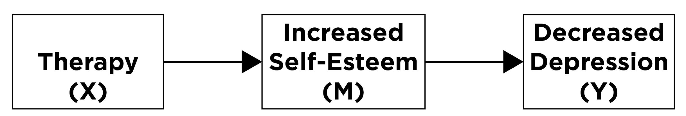

```{r setup, include = FALSE}
knitr::opts_chunk$set(echo = TRUE,
                      error = TRUE,
                      comment = "")
```

# Overview

This page briefly clarifies the difference between moderation (also called "interaction") and mediation.
Both types of effects involve (at least) three variables:

1. An independent/predictor variable, which will be labeled as `X`.
1. A dependent/outcome variable, which will be labeled as `Y`.
1. The mediator or moderator variable, which will be labeled as `M`.


# Mediation {#mediation}

## Overview {#mediationOverview}

**Mediation** is a <u>causal chain of events</u>, where one variable (a mediator variable) at least partially <u>explains (or accounts for) the association between two other variables</u> (the predictor variable and the outcome variable).
In mediation, a predictor (`X`) leads to a mediator (`M`), which leads to an outcome (`Y`).
Mediation answers the question of, "<u>**Why (or how)** does `X` influence `Y`?</u> A <u>mediator</u> (`M`) is a variable that helps explain the assocation between two other variables, and it answers the question of why/how `X` influences `Y`.
That is, the mediator is the variable that helps explain how/why `X` is related to `Y`.
In other words, you can think of the mediator as the <u>mechanism</u> that helps explain why `X` has an impact on `Y`.
The association between `X` and `Y` <u>gets smaller</u> when accounting for `M`.
Visually this can be written as:


where `X` is causing `M`, which in turn is causing `Y`.
In other words, `X` leads to `M`, and `M` leads to `Y`.
In clinical psychology, we often examine mediation when we investigate why certain therapies cause reductions in psychopathology like depression.
That is, what is the mechanism of a therapeutic technique <u>that helps</u> to reduce depression?
One can hypothesize that some therapies help increase a client's self-esteem, which in turn will help to reduce the client's depression.
In this case, increased self-esteem <u>mediates</u> (i.e., helps explain or account for) the effect of the therapy on decreased depression.

Question: <u>Why/how</u> does the therapeutic technique lead clients to experience fewer depressive symptoms?\
Answer: increased self-esteem

As a picture, we can draw this assocation as:



## Types of Mediation {#mediationTypes}

### Full Mediation {#fullMediation}

When one mechanism fully accounts for the effect of the predictor variable on the outcome variable, this is known as **full mediation**, as depicted below:


### Partial Mediation {#partialMediation}

When a single process partially—but does not fully—accounts for the effect of the predictor variable on the outcome variable; this is known as **partial mediation** and is depicted below:


### Multiple Mediators {#multipleMediators}

In addition, there can be multiple mediators/mechanisms that account for the effect of a predictor variable on an outcome variable, as depicted below:


# Moderation (i.e., Interaction) {#moderation}

## Overview {#moderationOverview}

**Moderation** (sometimes called an "interaction"), on the other hand, occurs when there is a variable or condition (`M`; called a "moderator") that <u>changes the assocation</u> between `X` and `Y`.
That is, the effect of the predictor variable on the outcome variable differs at different levels of the moderator variable.
In these cases, `X` and `M` <u>work together</u> to have an effect on `Y`; here `X` <u>does not have a direct effect</u> on `M`.
Moderation answers the question of, "<u>**For whom** does `X` influence `Y`?</u>"
If `X` influences `Y` more strongly for some people or in some circumstances, we would say that there is an interaction such that the <u>effect of `X` on `Y` depends on `M`</u>, as depicted below:


For example, if the effect of time passing on words recalled differs for those with and without an Alzheimer's diagnosis, the interaction could be depicted below:


## Types of Interactions {#interactionTypes}

There are two types of interaction effects: cross-over interactions and fan-shaped interactions.
Graphically, both types of interaction effects can be identified by the appearance of <u>non-parallel lines</u>.
However, the way these lines diverge from one another are what define whether it is a cross-over or fan-shaped interaction.

### Cross-Over Interaction {#crossoverInteraction}

A **cross-over interaction** occurs when individuals at different levels of `M` start at different points on `Y`, and when interacting with `X` the effects on `Y` go in different directions; when looking at a graph of the effects, you can see the lines "cross-over."
A visual representation of this kind of interaction can be displayed in a line graph with two groups:


Where the predictor/independent variable `X` is on the x-axis, the outcome/dependent variable `Y` is on the y-axis, and the different levels/groups of the moderator variable `M` are represented by the different colored lines in the graph (i.e., the z-axis).
An interaction can be identified visually by <u>non-parallel lines</u> at different levels of the moderator.

### Fan-Shaped Interaction {#fanShapedInteraction}

**Fan-shaped interactions** occur when individuals at different levels of `M` either start or end near each other on `Y`, but appear to diverge at different levels of `X`.
For example: there may be an interaction between the presence of Alzheimer's disease and time when predicting an individual's verbal memory.
Imagine a task where a list of words is repeatedly read to an individual.
After completing the task, they are asked to recall as many of those words as possible at various periods of time (e.g., at 5-minute intervals).
At first, early on in the assessment (i.e., after the first 5 minutes) the number of words recalled by individuals in both groups (i.e., at different levels of `M`) may not significantly differ from one another; individuals with and without Alzheimer's disease appear to recall the same amount of words.
However, as more time passes, the interaction effect between time and the presence of the disease becomes more apparent.
That is, at later time points (i.e., after 20 minutes) the gap between the amount of words recalled by both groups become significantly different.
In this case, we can say that <u>the presence of Alzheimer's disease interacts with the passing of time</u> to cause a faster decline in the number of words recalled.
In other words, the number of words recalled over time differs between individuals who have Alzheimer's versus individuals who do not.

Visually, this can be displayed in a line graph with two groups: 

 

In the above example, there is a stronger association between the passage of time and number of words recalled for the Alzheimer's diagnosis group compared to those without Alzheimer's.
For the Alzheimer's diagnosis group, there is a <u>strong</u> negative association between the passage of time and number of words recalled.
For those without Alzheimer's, there is a <u>weak</u> negative association between the passage of time and number of words recalled.
That is, <u>the effect of the passage of time on number of words recalled depends on whether the person has Alzheimer's</u>.
In terms of the number of words recalled, the passage of time <u>matters more</u> for those with Alzheimer's compared to those without Alzheimer's.

Question: <u>For whom</u> does the passage of time lead to fewer words recalled?\
Answer: those with Alzheimer's
