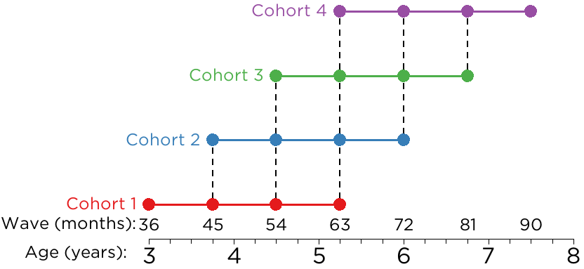

```{r setup, include = FALSE}
knitr::opts_chunk$set(
  echo = TRUE,
  error = TRUE,
  comment = "")
```

The School Readiness Study is a longitudinal study that follows children from 3–7 years of age to better understand how self-regulation and externalizing problems develop, from a bio-psycho-social perspective.
In this project, we place special emphasis on the development of neural functioning, as measured by electroencephalography/event-related potentials (EEG/ERP), and how neural development influences the development of children's self-regulation and externalizing problems.
EEG is a method of measuring meaningful differences in children's self-regulation through ERPs—EEG activity that occurs in response to stimuli—which may be a powerful way of reliably detecting patterns of brain activity that predict behavioral outcomes.

# Study Glossary

timepoint
: each 9-month interval when the target child (TC) comes in for Lab Visit 1 (LV1), Lab Visit 2 (LV2), etc.; 4 time points total per TC (T1–T4)

wave
: expected age of target child (TC) in months (36, 45, 54, 63, 72, 81, 90)

cohort
: subgroup of participants that reflects the age at which the participant was recruited

| Cohort | Age Recruited (months) | TCIDs     |
|:-------|:----------------------:|----------:|
| 1      | 36                     | 1001–1199 |
| 2      | 45                     | 1201–1399 |
| 3      | 54                     | 1401–1599 |
| 4      | 63                     | 1601–1799 |

LV1
: First lab visit (behavioral tasks, parent–child interaction tasks)

LV2
: Second lab visit (EEG)

Target Child (TC)
: the child participant

TCID
: the participant ID of the target child

Primary Caregiver (PC)
: the parent/caregiver of the target child

Parenting Partner (PP)
: the Parenting Partner of the child's Primary Caregiver

Secondary Caregiver (SC)
: the Secondary Caregiver of the child; could be a teacher, babysitter, nanny, grandparent, other relative, or another caregiver who knows the child well

# Sample

The sample is a community sample of children and their parent(s)/caregiver(s) in addition to a secondary caregiver (e.g., teacher, babysitter).
The sample is recruited from 12 counties within a 50-mile radius of Iowa City, Iowa.

## Inclusion Criteria

The inclusion criteria for each cohort are:

- Cohort 1: 3, 3.75, 4.5, or 5.25 years old
- Cohort 2: 3.75, 4.5, 5.25, or 6 years old
- Cohort 3: 4.5, 5.25, 6, or 6.75 years old
- Cohort 4: 5.25, 6, 6.75, or 7.5 years old

## Exclusion Criteria

The exclusion criteria are:

- The child is older than 7.5 years of age (i.e., the child has aged out of study)
- Anyone who does not consent
- Children whose Primary Caregiver does not speak English
- The child does not have normal or corrected-to-normal vision and hearing (i.e., the study tasks would not be valid for assessing the child's skills)
- The child has extremely poor expressive and receptive language skills in English (i.e., the child would not be able to speak or understand basic task instructions)
- The child does not have a permanent guardian (i.e., the child is in foster care or is a ward of the State)

# Research Design

Each participant is assessed every 9 months for each of 4 timepoints, a total of 2¼ years.
Lab Visit 1 and Lab Visit 2 are completed approximately one week apart at each timepoint.



# Open Science Framework

For more information on the study, including papers from the project, the available measures, the Data Dictionary, and the pre-registered hypotheses, see the project page for the School Readiness Study on the Open Science Framework (OSF): https://osf.io/jzxb8

# Papers

A bibliography of papers from the study is located here:
https://docs.google.com/document/d/1yfNcWqayX5DdA5bdI9rk8fEB6M9Y-T8GxVvejqHZGF8/edit

# Available Measures

To see a list of measures available for the School Readiness Study (organized by domain), see here:
https://docs.google.com/spreadsheets/d/1ptL0GdSHAjAA7zpZGABYuUy9U6eR3XJZI0mzB1wDPn8/edit?usp=sharing

# Videos of Procedures

To see example videos of our lab tasks and procedures, see here (you must register for and sign into [Databrary](https://nyu.databrary.org) to access):
https://nyu.databrary.org/volume/1559

# Data Dictionary

A Data Dictionary is a file that describes the meaning of variables that are in a data file.
To access the Data Dictionary for the composite/summary variables in the School Readiness Study, see here:
https://docs.google.com/spreadsheets/d/1N5fALfKQQsw4frQxlPoG19MakvzA2HwKs9hSgt2Yax0/edit?usp=sharing

To access the Data Dictionary for the School Readiness Study Project in REDCap, see here[^1]:
https://redcap.icts.uiowa.edu/redcap/redcap_v9.9.1/Design/data_dictionary_codebook.php?pid=4941

To access the data dictionary for the School Readiness Study Screening Project in REDCap, see here[^1]:
https://redcap.icts.uiowa.edu/redcap/redcap_v9.9.1/Design/data_dictionary_codebook.php?pid=4958

# Pre-registered Hypotheses

To see the pre-registered hypotheses for the study, see here: https://osf.io/gpn5y

# Documentation

Documentation for the School Readiness Study is on the lab drive at the following location[^1]:
    `\\lc-rs-store24.hpc.uiowa.edu\lss_itpetersen\Lab\Studies\School Readiness Study\Wiki\_site\index.html`

[^1]: Only accessible by team members.
