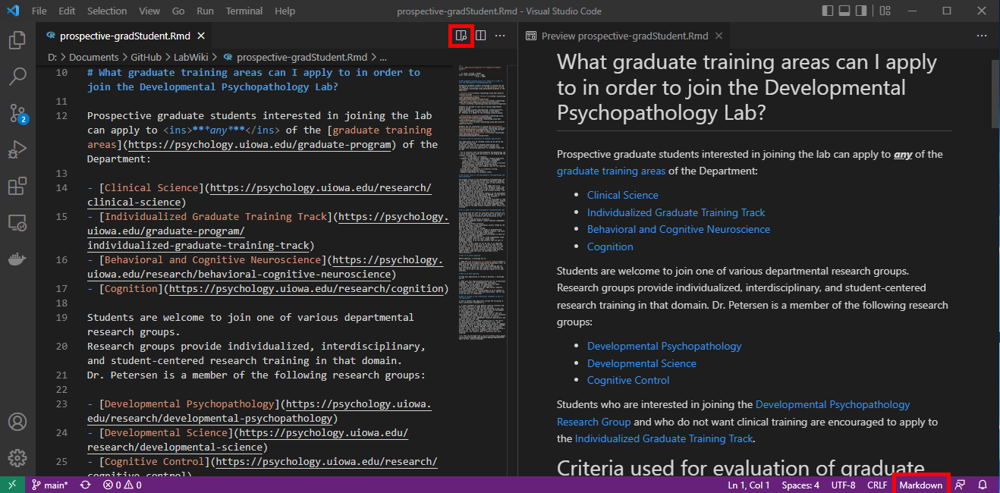

```{r setup, include = FALSE}
knitr::opts_chunk$set(
  echo = TRUE,
  error = TRUE,
  comment = "",
  class.source = "fold-show")
```

# Tips and Tricks

1. You can view the source code side-by-side with the Preview (after selecting the code type in the bottom right):

1. To wrap code around the selected text (https://stackoverflow.com/a/73344832/2029527; archived at https://perma.cc/P5JA-7DBC):
    1. Press `Ctrl`+`Shift`+`p`
    1. Type and select "Open Keyboard Shortcuts (JSON)"
    1. Add the following item:
```
[
    {
        "key": "alt+shift+e",
        "command": "editor.action.insertSnippet",
        "when": "editorTextFocus",
        "args": {
            "snippet": "<TEXT-BEFORE>$TM_SELECTED_TEXT</TEXT-AFTER>"
        }
    }
]
```
    1. Save the `keybindings.json` file.
    1. Select the text you want to wrap, and press `Alt`+`Shift`+`e`

# Example Code Snippets

## Template

```
[
    {
        "key": "alt+shift+e",
        "command": "editor.action.insertSnippet",
        "when": "editorTextFocus",
        "args": {
            "snippet": "<TEXT-BEFORE>$TM_SELECTED_TEXT</TEXT-AFTER>"
        }
    }
]
```

##  `\begin{equation}...\end{equation}`

```
[
    {
        "key": "alt+shift+e",
        "command": "editor.action.insertSnippet",
        "when": "editorTextFocus",
        "args": {
            "snippet": "\\begin{equation}\n$TM_SELECTED_TEXT\n\\end{equation}"
        }
    }
]
```

# Connect to `R`

Follow the instructions here to connect `VSCode` to `R`:
https://stackoverflow.com/a/66069540/2029527 (archived at https://perma.cc/FCF5-26BT)

1. Install the `R` extension
1. Go into the `R` extension settings
1. Set the `R` path to the path of your `R` installation:
    - e.g., `C:\\R\\R-4.3.1\\bin\\x64\\R.exe`
1. Set the `Rterm` path to the path of your `R` installation
    - e.g., `C:\\R\\R-4.3.1\\bin\\x64\\Rterm.exe`
